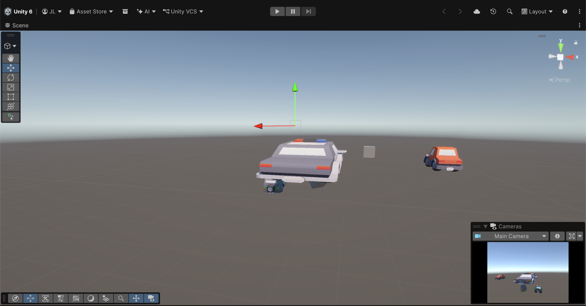
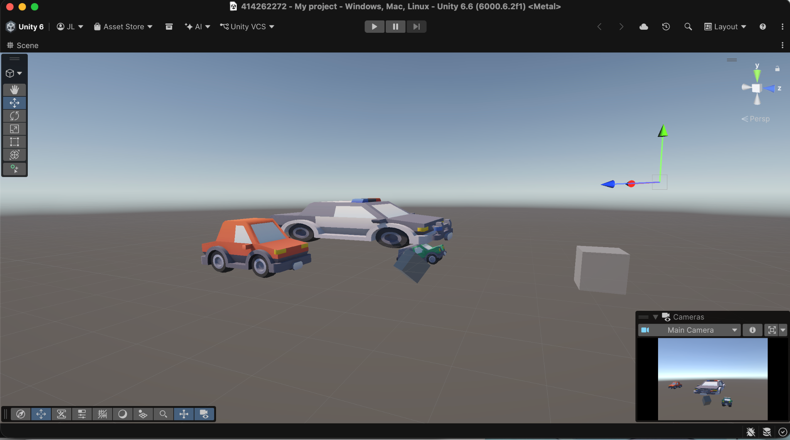
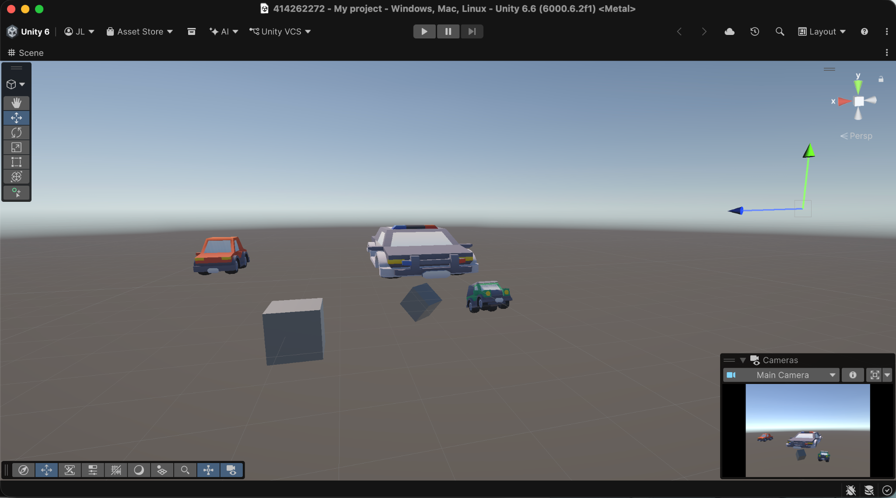
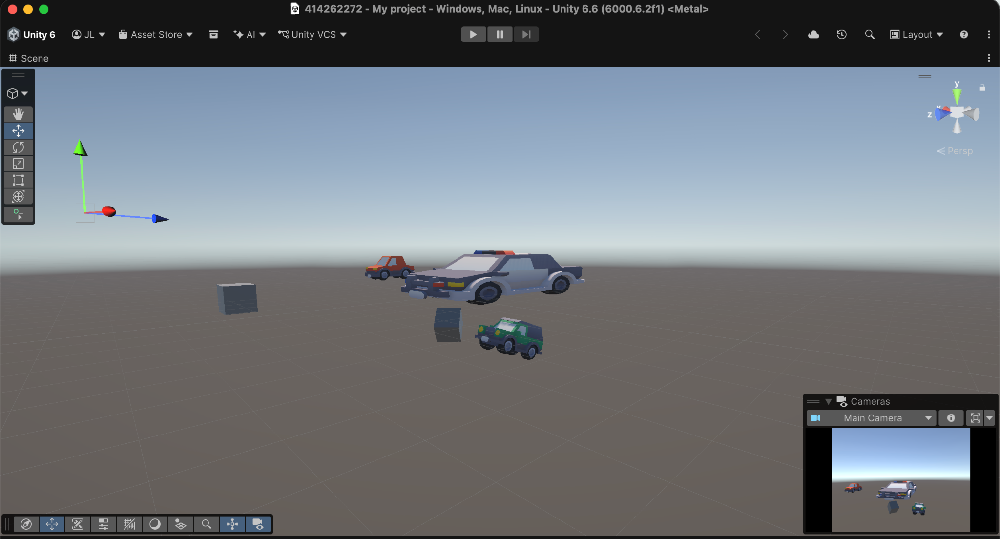

# 1151VR-HW1-414262272-LCH

## 一、專案截圖

### 截圖 1

### 截圖 2

### 截圖 3

### 截圖 4

---

## 二、GitHub 連結
- [https://github.com/Johnson-bro-coder/1151VR-HW1-414262272-LCH](https://github.com/Johnson-bro-coder/1151VR-HW1-414262272-LCH)

---

## 三、YouTube 連結
- [https://youtu.be/jUBbjNpHbNw](https://youtu.be/jUBbjNpHbNw)

---

## 四、說明製作流程和相關操作
下載完 Unity 後就照著簡報還有書上的步驟去慢慢熟悉，中間遇到的問題是下載外部的 Assets 時常遇到版本不符或是無法載入的狀況，後續在詢問 AI 後總算找到可以使用的模型。有了模型後就開始做移動、旋轉等操作，一開始會遇到模型不在鏡頭的範圍內，但慢慢調整鏡頭的位置後也成功把所有物體都移到鏡頭內。
